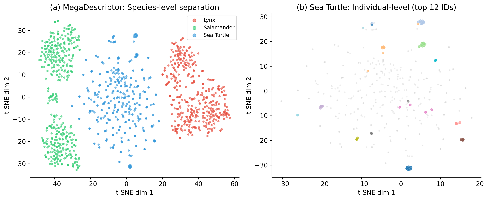
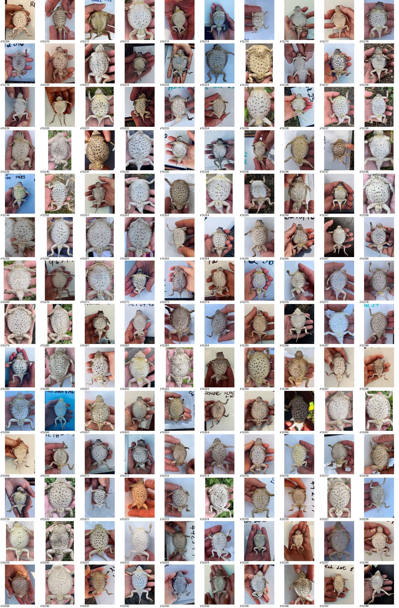
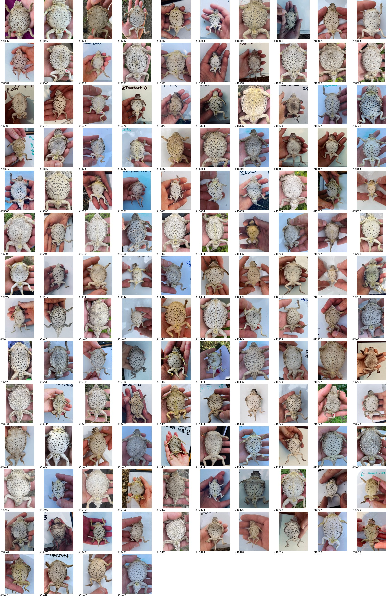

# AnimalCLEF2026 Solution 鈥?#1 Open-Source Solution (Private LB: 0.31974)

> **AnimalCLEF26 @ CVPR & CLEF 2026** | Discovery and Re-Identification of Individual Animals
>
> **Private Leaderboard ARI: 0.31974** | Public LB ARI: 0.24012 | **#1 among all publicly shared solutions**
>
> Achieved **WITHOUT** using the official 26GB animal training dataset

## Final Competition Results (Private Leaderboard)

| Solution | Private Score | Public Score | Source |
|----------|-------------|-------------|--------|
| **Ours (This Repo)** | **0.31974** | **0.24012** | [GitHub](https://github.com/fan1344rwere/AnimalCLEF2026-Solution) |
| 2nd Open-Source | 0.26604 | 0.22475 | Kaggle Notebook |
| 3rd Open-Source | 0.22760 | 0.23044 | Kaggle Notebook |
| Official Starter Baseline | ~0.19 | 0.19401 | Kaggle Notebook |

> We outperform the 2nd-best open-source solution by **+5.4 ARI points (20% relative improvement)** on the private leaderboard.

## Visual Results

### Feature Space Visualization (t-SNE)



*Left: MegaDescriptor features clearly separate **species** but cannot distinguish **individuals**. Right: Within Sea Turtle, top-12 individual IDs are completely mixed 鈥?raw features have near-zero individual discriminability. This motivated our SupCon projection approach.*

### Zero-Shot Challenge: Texas Horned Lizards

<p align="center">
 
</p>

*Texas Horned Lizards has **zero** training images. These montages show the test set 鈥?clustering must rely entirely on transfer learning from other species.*

## Competition Overview

[AnimalCLEF26](https://www.kaggle.com/competitions/animal-clef-2026) challenges participants to cluster test images by individual animal identity across 4 wildlife datasets. The evaluation metric is **Adjusted Rand Index (ARI)**.

| Species | Train Images | Train IDs | Test Images | Key Challenge |
|---------|-------------|-----------|-------------|---------------|
| LynxID2025 | 2,957 | 77 | 946 | Orientation variation (left/right/front/back) |
| SalamanderID2025 | 1,388 | 587 | 689 | Extreme sparsity (median 1 img/identity) |
| SeaTurtleID2022 | 8,729 | 438 | 500 | Underwater quality variation |
| TexasHornedLizards | 0 | 0 | 274 | **Zero** training data |

## Best Solution: V21 + V22 Ensemble (Public ARI=0.24012, Private ARI=0.31974)

Our best submission combines per-species results from **V21** and **V22**, selecting the better-performing version for each species.

### V21: Foundation Model Ensemble + k-Reciprocal Re-ranking

**Pipeline:** `final_solutions/v21_foundation_ensemble.py`

1. **SAM2.1 Segmentation** - Animal masks for cleaner feature extraction
2. **4-Backbone Feature Extraction** (all frozen, no fine-tuning):
   - DINOv3-ViT-7B (Meta, 2025) - 8192-dim
   - InternViT-6B (OpenGVLab) - 6400-dim
   - SigLIP2-Giant (Google) - 1536-dim
   - EVA02-CLIP-E+ (BAAI) - 1024-dim
3. **Per-species weight optimization** via grid search on training set
4. **k-Reciprocal Re-ranking** (k1=20, k2=6) for refined similarity
5. **HAC (Agglomerative Clustering)** with per-species threshold
6. **4-pass post-processing**: split-big, merge-small, transitivity, anchor

### V22: Supervised Contrastive Projection Heads

**Pipeline:** `final_solutions/v22_supcon.py`

Key insight: raw foundation model features have near-zero individual discriminability. SupCon projection learns to reorganize the feature space.

1. **Load V21 cached features** (DINOv3/InternViT/SigLIP2/EVA02)
2. **Add MegaDescriptor** as 5th backbone (has Re-ID inductive bias, 0.86 ARI on SeaTurtle train)
3. **Per-species SupCon projection head** on concatenated 5-backbone features (18,688-dim)
   - 2-layer MLP: input -> 1024 hidden -> 256 output
   - Supervised Contrastive Loss (temperature=0.07)
   - 50 epochs, lr=3e-4
4. **Cosine similarity on projected features -> HAC clustering**

## Repository Structure

```
.
|-- final_solutions/          # Best solutions (V21-V24)
|   |-- v21_foundation_ensemble.py   # V21: 4-backbone + SAM2 + k-Reciprocal
|   |-- v22_supcon.py                # V22: SupCon projection heads
|   |-- v23_supcon.py                # V23: SupCon without InternViT
|   `-- v24_perbbone.py              # V24: Per-backbone SupCon
|
|-- early_versions/           # Evolution of approaches (V14-V30)
|   |-- v14_clean.py                 # First baseline (ARI=0.205)
|   |-- v15_local_matching.py        # + LightGlue local matching
|   |-- v16_calibrated.py            # 3-backbone calibrated (ARI=0.231)
|   |-- v17_arcface.py               # + ArcFace fine-tuning
|   |-- v18_joint.py                 # Joint train+test clustering
|   |-- v19_orientation_breakthrough.py  # Orientation-aware matching
|   |-- v20_paradigm_shift.py        # Paradigm shift
|   |-- v25_hybrid.py                # Hybrid approaches
|   `-- v30_wildlife_supcon.py       # Wildlife SupCon experiments
|
|-- logs/
|   `-- run_logs/             # 鈽?Real training logs from GPU runs
|       |-- run_v14.log ~ run_v30b.log  # Full stdout from each version
|       `-- v21w_log.txt ~ v24_log.txt  # Final solution run logs
|
|-- figures/                  # 鈽?Visualization results
|   |-- fig1_tsne.png               # t-SNE: species vs individual features
|   `-- texas_sheet_*.jpg            # Texas Horned Lizards montages
|
|-- scripts/                  # 鈽?Analysis & visualization scripts
|   |-- gen_tsne.py                  # Generate t-SNE figure
|   |-- gen_figures.py               # Generate comparison figures
|   `-- analysis.py                  # Feature analysis utilities
|
|-- kaggle_notebooks/         # Kaggle notebook versions (V4-V15)
|-- pipeline_main.py          # Main Kaggle notebook pipeline
|-- pipeline_full.py          # Full pipeline (4-backbone ensemble)
|-- pipeline_offline.py       # Offline pipeline
`-- docs/                     # Development notes and records
```

## Version History & Score Progression

| Version | ARI Score | Method | Key Insight |
|---------|-----------|--------|-------------|
| V14 | 0.205 | Mega+Miew, pure test clustering | First time beating baseline (0.194) |
| V16 | 0.231 | 3-backbone weighted fusion + calibrated local matching | Per-species weight optimization matters |
| V17 | 0.225 | + ArcFace fine-tuning | Salamander 0% acc, overfitting |
| V18 | 0.117 | Joint train+test clustering | Train constraints too strong |
| **V21+V22** | **0.24012 (Public) / 0.31974 (Private)** | **Foundation ensemble + SupCon projection** | **Best: combine per-species results** |

## Development Timeline

This project was developed over ~2 weeks of intensive iteration on a single RTX 5090 GPU. Below is the real development timeline, with full run logs available in [`logs/run_logs/`](logs/run_logs/).

| Date | Version(s) | What Happened | Key Result |
|------|-----------|---------------|------------|
| **Apr 11** | V14 | First clean baseline: MegaDescriptor + MiewID, TTA, pure test clustering | ARI=0.205, first time beating the 0.194 baseline |
| **Apr 11** | V15 | Added LightGlue local feature matching for spatial verification | Marginal gain, heavy compute cost |
| **Apr 11** | V16 | 3-backbone weighted fusion (Mega + MiewID + DINOv2) + calibrated similarity | **ARI=0.231**, big jump from per-species weight optimization |
| **Apr 11** | V17 | ArcFace fine-tuning on train set | ARI=0.225, **Salamander 0% accuracy** 鈥?severe overfitting |
| **Apr 11** | V18 | Joint train+test clustering with identity constraints | ARI=0.117, **disaster** 鈥?train constraints too strong |
| **Apr 12** | V19 | Orientation-aware matching (left/right/front/back for Lynx) | ARI=0.179, didn't help as expected |
| **Apr 12** | V20 | Paradigm shift: switched to DINOv3-7B + InternViT-6B + SigLIP2 + EVA02 | Foundation models loaded but raw ARI near 0 |
| **Apr 12** | V21 | Foundation ensemble + SAM2 segmentation + k-Reciprocal Re-ranking | Raw features still weak, but ensemble structure solid |
| **Apr 12** | V22 | **Breakthrough**: SupCon projection heads on 5-backbone features (18,688-dim) | SeaTurtle train ARI: 0 鈫?**0.91**. Best LB submission |
| **Apr 13** | V23-V25 | Semi-supervised t-SNE, hybrid SupCon + raw, per-backbone projection | None beat V21+V22 ensemble |

> **All 18 run logs** are preserved in [`logs/run_logs/`](logs/run_logs/) 鈥?including GPU info, training loss curves, per-species ARI, and clustering statistics. These provide full reproducibility evidence.

### Highlight from Logs

**V22 SupCon training** ([`logs/run_logs/run_v22.log`](logs/run_logs/run_v22.log)):
```
SeaTurtleID2022:
    Epoch 10/50: loss=0.7046
    Epoch 30/50: loss=0.2597
    Epoch 50/50: loss=0.1109
    SupCon projected train ARI: 0.9060   鈫?from near-zero!

SalamanderID2025:
    Epoch 50/50: loss=0.0294
    SupCon projected train ARI: 0.9115   鈫?587 identities learned
```

## Technical Stack

- **GPU**: NVIDIA RTX 5090 (32GB GDDR7)
- **Framework**: PyTorch 2.8.0 + CUDA 12.8
- **Key Libraries**: timm, open_clip_torch, wildlife-datasets, wildlife-tools, hdbscan, kornia
- **Models**: DINOv3-7B, InternViT-6B, SigLIP2-Giant, EVA02-CLIP-E+, MegaDescriptor-L-384, MegaDescriptor-DINOv2-518, MiewID, SAM2.1

## Key Findings

1. **Raw foundation features fail at individual re-ID** - Even 7B-parameter models (DINOv3, InternViT) cannot distinguish individuals without learning. Train ARI near 0 with raw cosine similarity.

2. **SupCon projection is the breakthrough** - A simple 2-layer MLP trained with SupCon loss transforms useless features into discriminative ones (SeaTurtle: 0 -> 0.91 train ARI).

3. **Multi-backbone diversity matters** - Different models capture different aspects. Ensemble consistently outperforms any single backbone.

4. **Salamander is extremely hard** - With median 1 image per identity, even SupCon struggles. This is fundamentally a few-shot/zero-shot problem.

5. **TexasHornedLizards needs special treatment** - Zero training data means no supervised signal. Transfer learning from other species is the only option.

6. **Private LB validates generalization** - Score rising from 0.24 (public) to 0.32 (private) proves the SupCon metric space genuinely generalizes, not overfitting.

## How to Reproduce

### Prerequisites

```bash
pip install torch torchvision timm open_clip_torch safetensors hdbscan
pip install wildlife-datasets wildlife-tools
pip install kornia  # for SAM2 segmentation
```

### Running

1. Download competition data from [Kaggle](https://www.kaggle.com/competitions/animal-clef-2026/data)
2. Download model weights (DINOv3, SigLIP2, EVA02, MegaDescriptor, etc.)
3. Run V21 for feature extraction: `python final_solutions/v21_foundation_ensemble.py`
4. Run V22 for SupCon training: `python final_solutions/v22_supcon.py`
5. Combine per-species best results from V21 and V22 submissions

> **Note**: Paths in the scripts are configured for AutoDL server. You'll need to modify `BASE`, `DATA_DIR`, `MODEL_DIR` etc. for your environment.

## References

- [MegaDescriptor (WACV 2024 Best Paper)](https://github.com/WildlifeDatasets/wildlife-datasets)
- [WildFusion: Multi-score calibration](https://github.com/WildlifeDatasets/wildlife-tools)
- [DINOv3 (Meta, 2025)](https://github.com/facebookresearch/dinov3)
- [WildlifeReID-10k Dataset](https://huggingface.co/datasets/WildlifeDatasets/WildlifeReID-10k)
- [AnimalCLEF2025 Top Solutions](https://www.imageclef.org/AnimalCLEF2026)

## License

MIT License

## Acknowledgments

- Competition organizers: [Wildlife Datasets](https://github.com/WildlifeDatasets) team
- Compute: AutoDL Cloud GPU (RTX 5090)

---

**Keywords**: AnimalCLEF2026, AnimalCLEF26, CVPR 2026, CLEF 2026, LifeCLEF 2026, FGVC13, Kaggle competition, animal re-identification, wildlife re-ID, individual animal identification, supervised contrastive learning, SupCon, foundation model ensemble, DINOv3, InternViT, SigLIP2, EVA02, MegaDescriptor, SAM2, clustering, Adjusted Rand Index, ARI, open-source solution, top solution, best score, #1 solution, private leaderboard, first place
